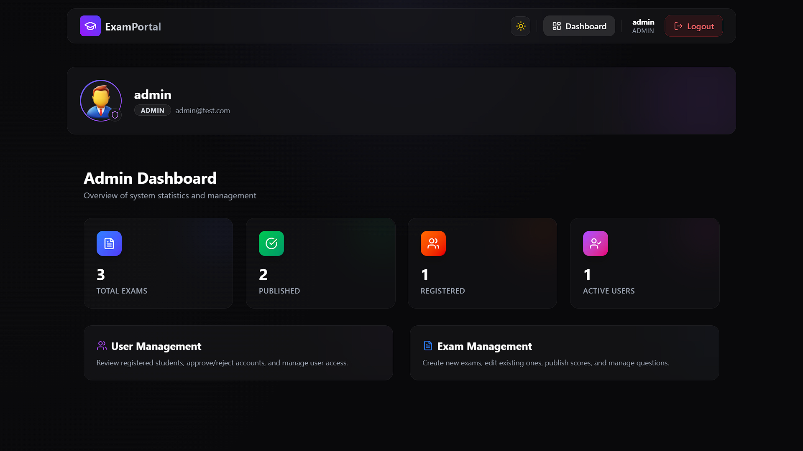
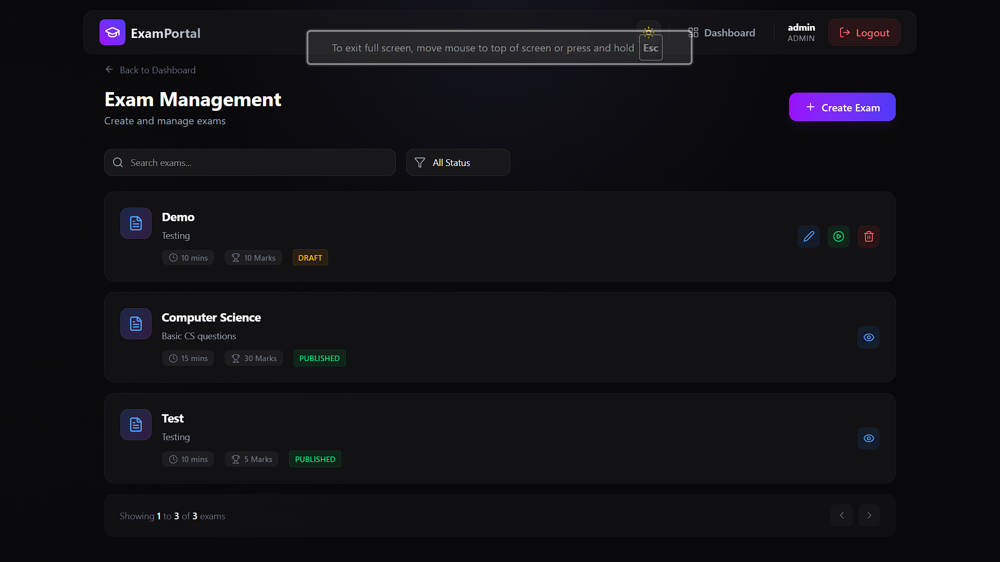
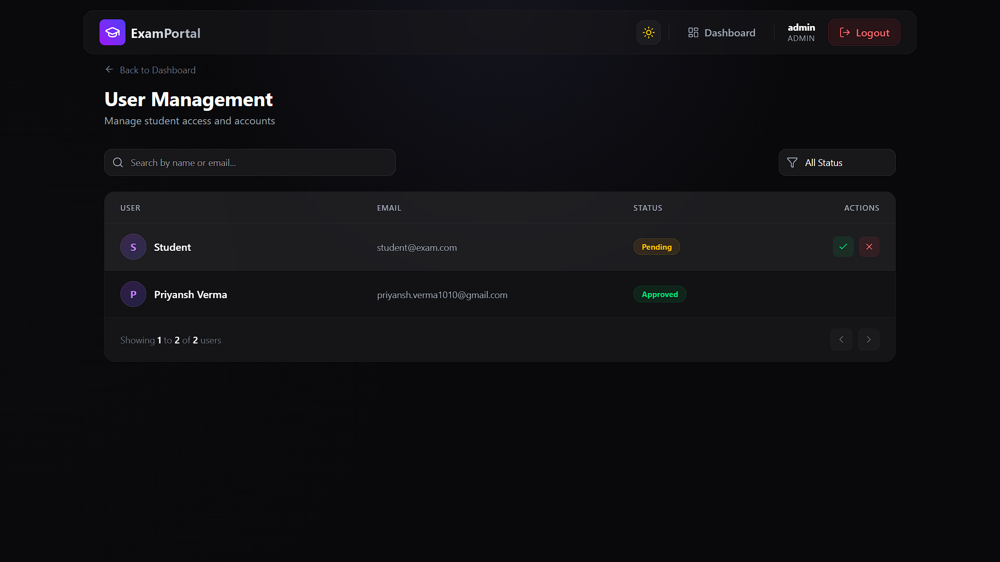
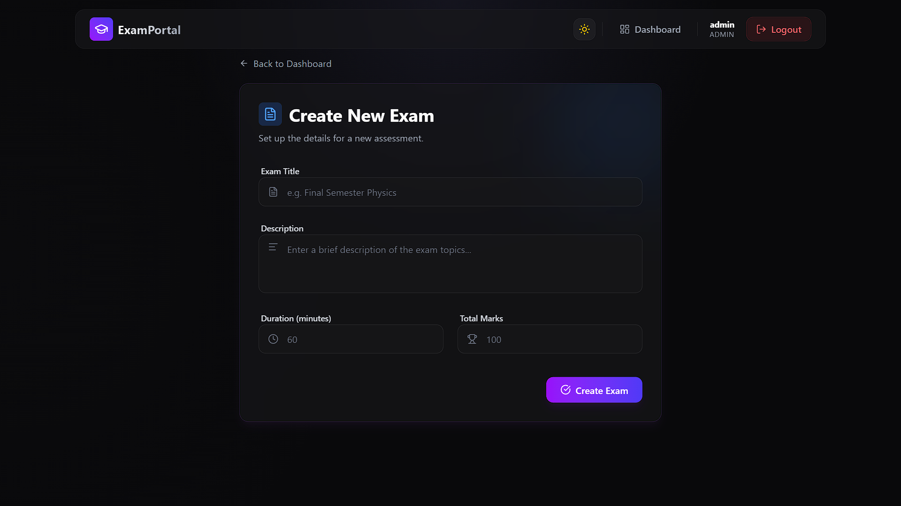
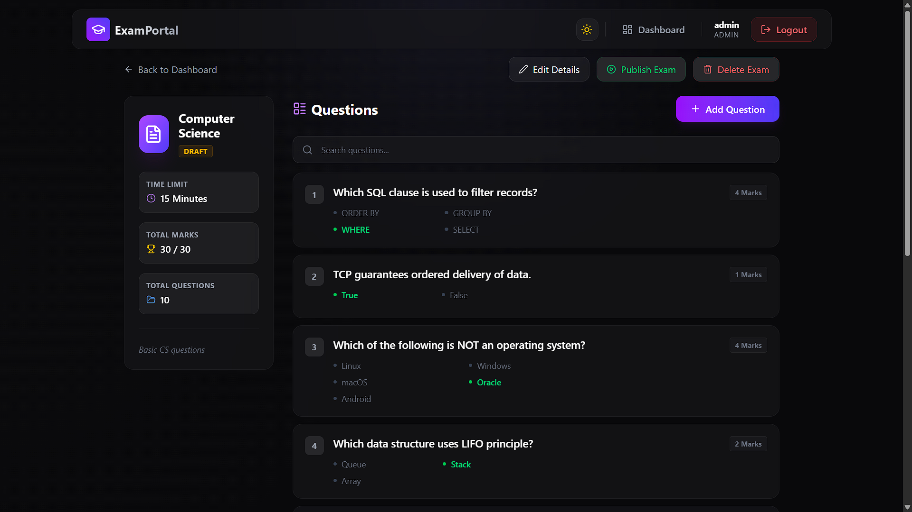
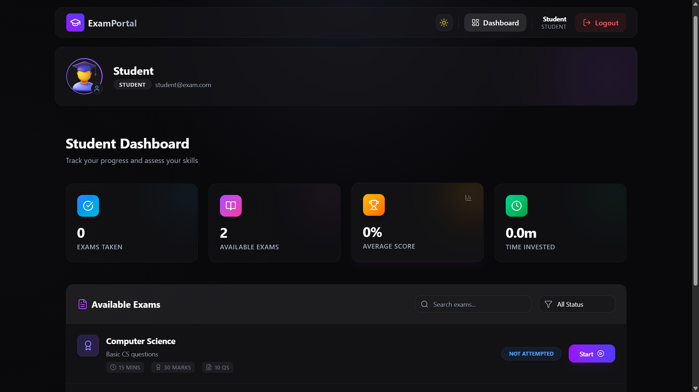
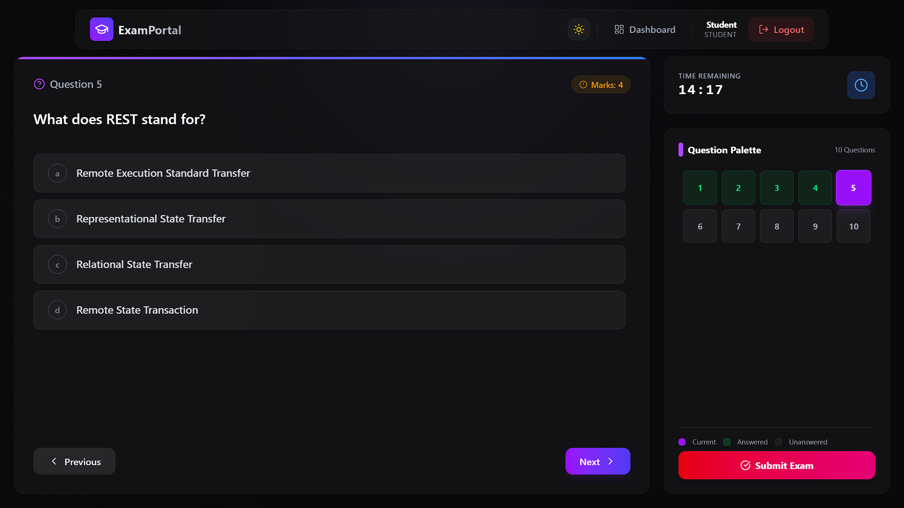
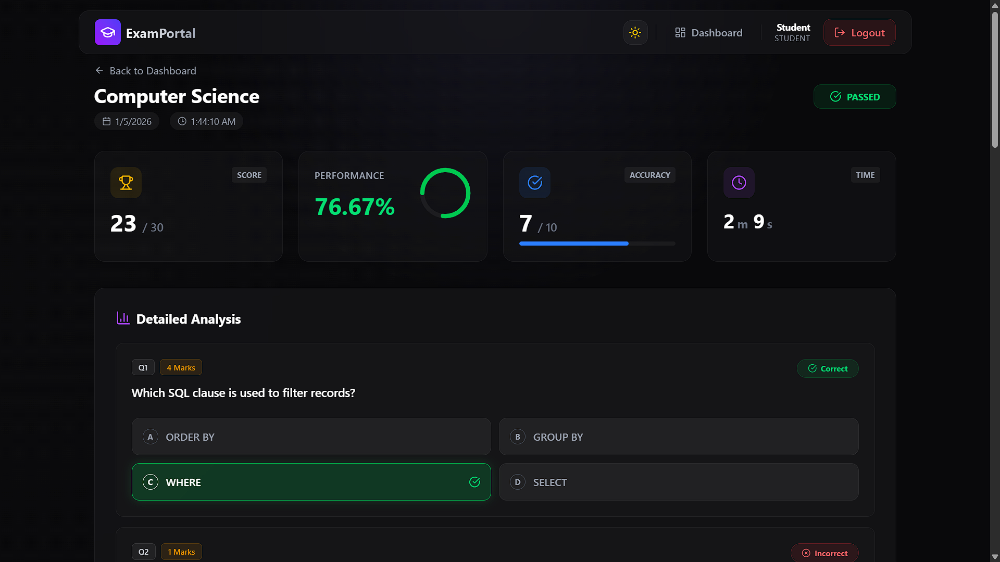

# Online Exam System

A comprehensive, full-stack online examination platform designed to facilitate secure and efficient exam management and test-taking.

## 🚀 Features

-   **Role-Based Access**: Distinct portals for Administrators and Students.
-   **Admin Dashboard**: Manage exams, questions, and users with ease.
-   **Student Dashboard**: View available exams, attempt history, and results.
-   **Live Exam Interface**: Interactive test-taking experience with timer and auto-submit functionality.
-   **Instant Results**: Real-time scoring and detailed performance review.

## 🛠️ Technology Stack

### Frontend
-   **Framework**: React 19
-   **Build Tool**: Vite
-   **Styling**: Tailwind CSS v4
-   **Icons**: Lucide React

### Backend
-   **Language**: Java 17 (Jakarta EE)
-   **Core**: Pure Servlets
-   **Database**: MySQL 8.0
-   **Build Tool**: Maven

## 📂 Documentation

Detailed documentation for setting up and understanding the codebase is available in the respective directories:

*   **[Frontend Documentation](Frontend/FRONTEND_DOCS.md)**: Setup, project structure, and component details.
*   **[Backend Documentation](Backend/BACKEND_DOCS.md)**: Server setup, API endpoints, and database schema.

## ⚡ Quick Start

### 1. Backend Setup
1.  Navigate to `Backend/`.
2.  Import the project into your IDE (Eclipse/IntelliJ).
3.  Configure your MySQL database connection in `src/main/java/com/exam/util/DBUtil.java`.
4.  Build with `mvn clean install`.
5.  Deploy the WAR to Tomcat.

### 2. Frontend Setup
1.  Navigate to `Frontend/`.
2.  Run `npm install`.
3.  Run `npm run dev`.
4.  Open `http://localhost:5173`.

## 📸 Screenshots

### Admin Portal

*Admin Dashboard - Manage exams and users*

*Exam Management - View and manage exams*

*User Management - View and manage users*

*Exam Creation - Set details and add questions*

*Exam Editing - Modify exam details and questions*

### Student Portal

*Student Dashboard - View and start available exams*

*Live Exam - Interactive test-taking interface*

*Result Page - Instant score and answer review*

## 📄 License
This project is for educational purposes.

---
Developed by **Priyansh Verma**
